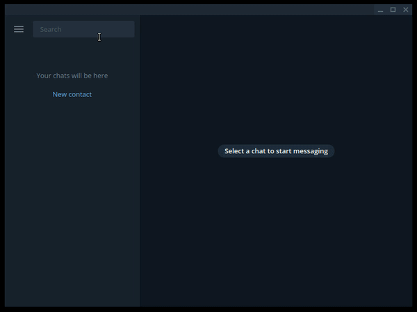
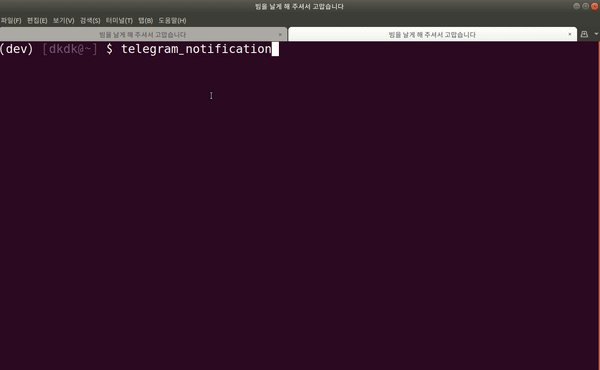
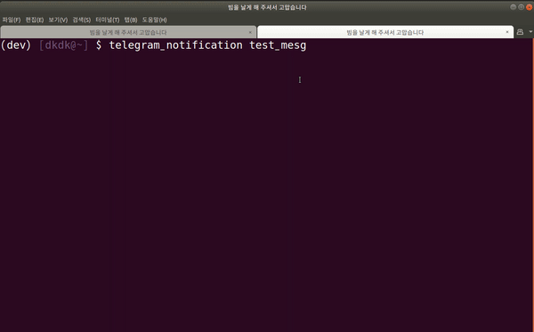

# getting started

## 0. Install the utility.

Simply install.
```
$ pip install telegram-notification
```

## 1. Create your Telegram Bot.



- Search for `BotFather` on Telegram
- Enter `/start`
- Enter `/newbot`
- Enter `{your bot name}`
- Enter `{your bot id}`

## 2. Set your bot's token & user_id. 




- Enter `telegram_notification` in the terminal.
- Enter the created bot token.
- Send `/start` to your bot.
- When confirmed, exit the program. (CTRL+c)

## 4. Use it anytime.




- Run it as a single command or use a pipe or use it in a shell script.

